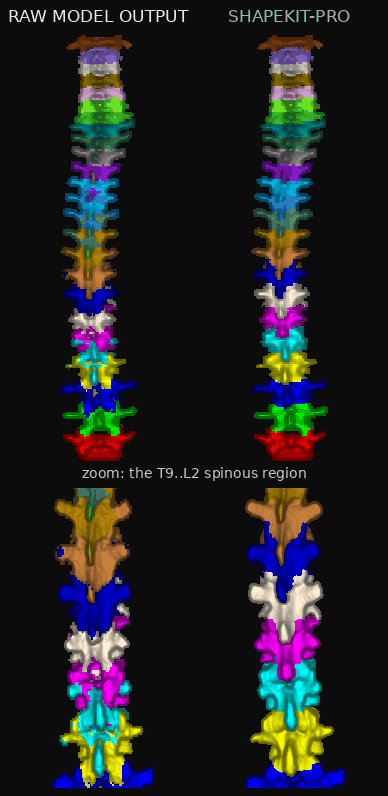
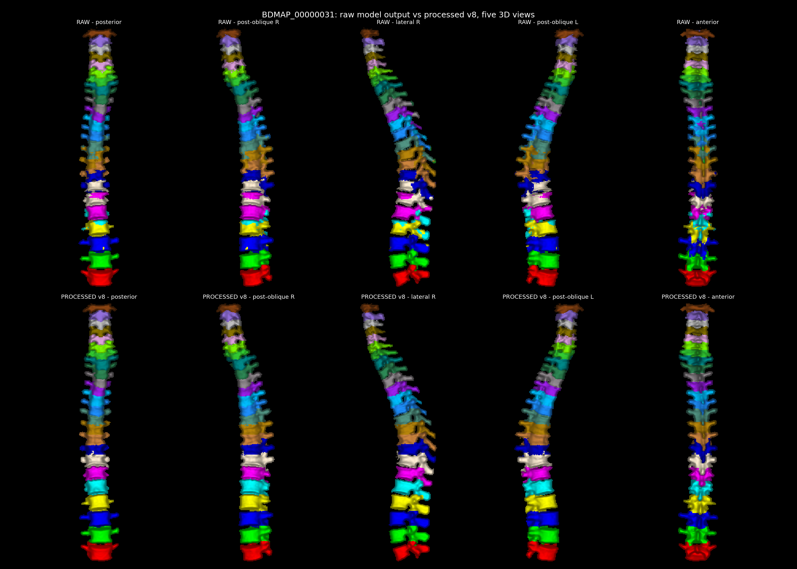
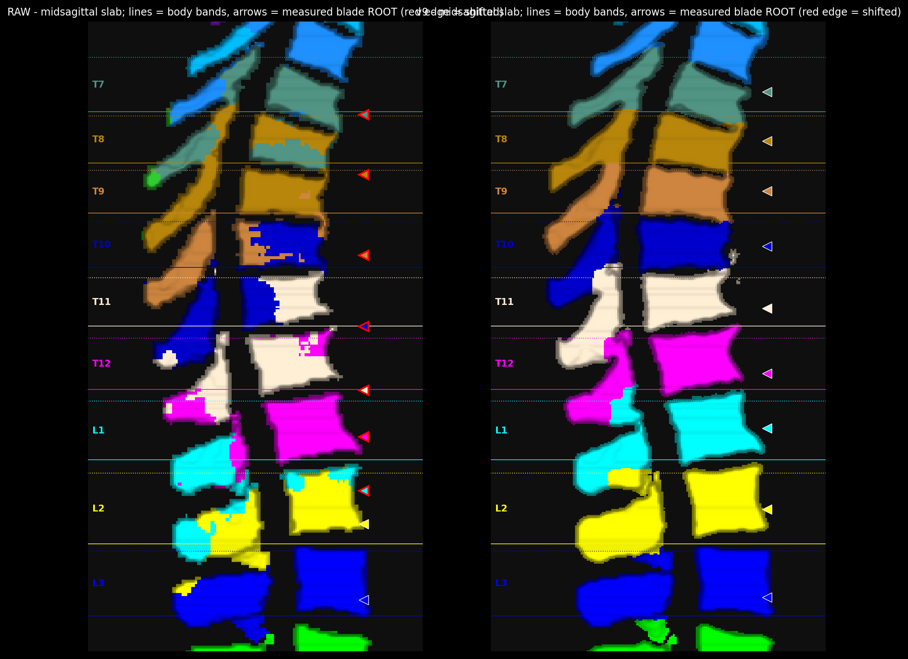
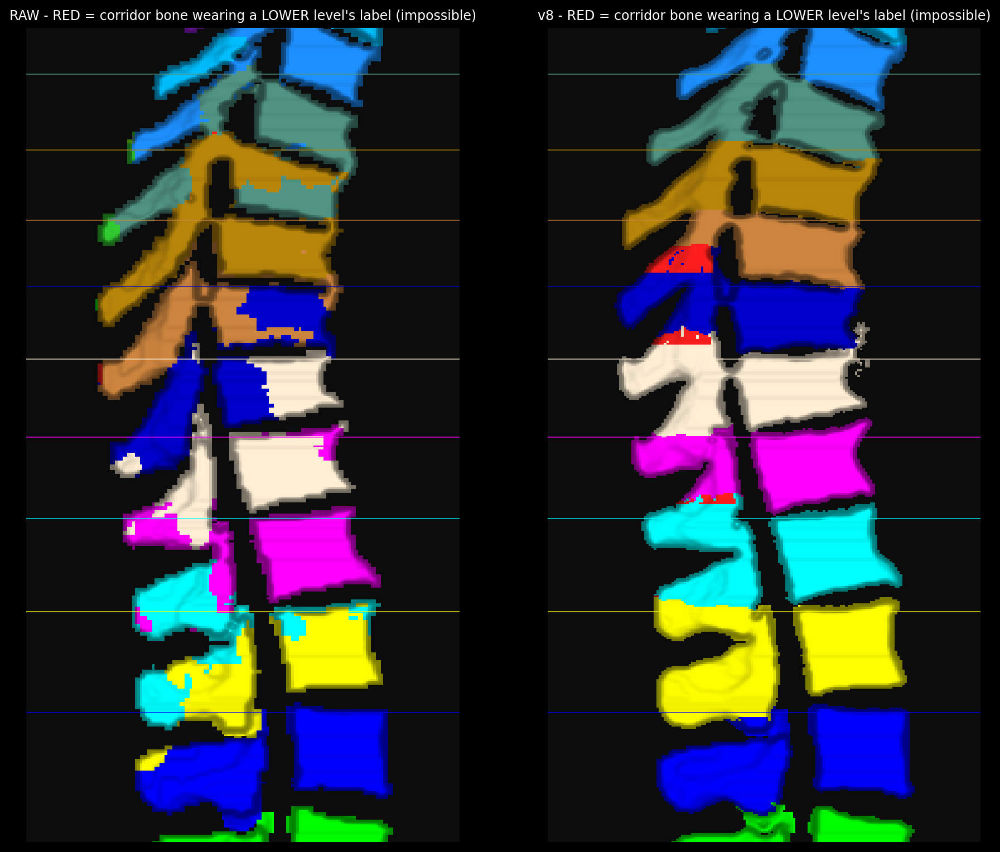
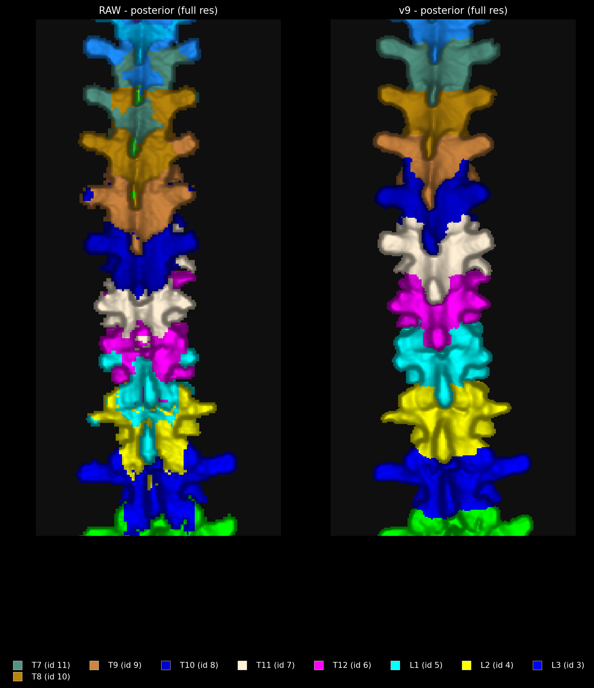
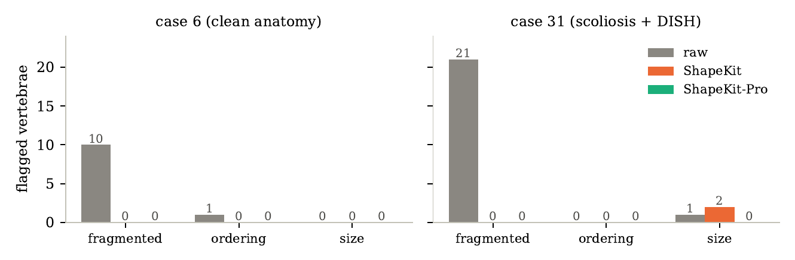
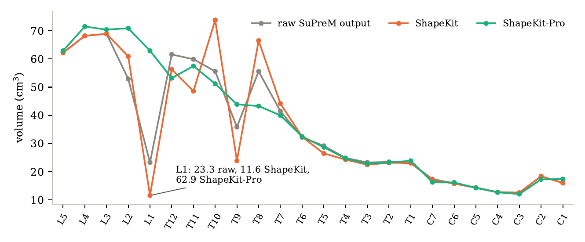
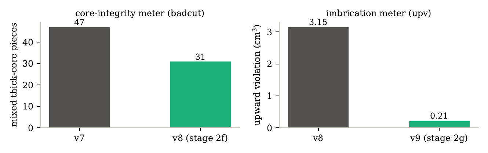
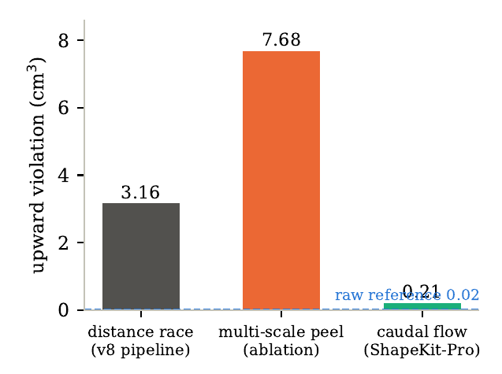

<p align="center">
  
  &nbsp;&nbsp;&nbsp;&nbsp;&nbsp;&nbsp;
  
</p>

<h1 align="center">ShapeKit-Pro</h1>

<p align="center"><b>Anatomy-aware, evidence-gated repair of vertebra labels in CT segmentations.<br>
Recolors what the model got wrong. Never deletes real bone. CPU-only, one file.</b></p>

---

Segmentation models label vertebrae well until anatomy gets hard: scoliosis,
collapsed discs, DISH/ankylosis, and steeply overlapping spinous processes make
them fragment labels, misplace whole levels, and paint one vertebra's bone with
its neighbor's color. Delete-only cleanup tools (like the
[ShapeKit](https://github.com/BodyMaps/ShapeKit) baseline this project is named
after, and goes beyond) remove the noise but also remove real bone — and cannot
give a mislabeled process back to its true owner.

**ShapeKit-Pro** (`postprocessing_vertebrae.py`, a single ~2k-line CPU-only
file) takes the model's prediction plus the CT and *repairs the labels in
place*: the raw prediction is the outer envelope, the CT is the only editor,
and every stage carries its own defect meter and reverts itself if it cannot
prove improvement. Validated on the two AbdomenAtlasDemo CT cases with
[SuPreM](https://github.com/MrGiovanni/SuPreM) Swin UNETR predictions as input,
against [ShapeKit](https://github.com/BodyMaps/ShapeKit) as the standing
baseline — with identical parameters on both cases, no per-case tuning:

| case | raw model output | ShapeKit (delete-only baseline) | **ShapeKit-Pro** |
|---|---|---|---|
| BDMAP_00000006 (clean anatomy) | 10 fragmented labels, 1 ordering violation | clean, but **deletes** real C1 bone | all clean, every CT-certified bone voxel preserved |
| BDMAP_00000031 (scoliosis + DISH/ankylosis) | 21 fragmented labels, L1 at 23 cm³ vs ~60 cm³ neighbors, spinous processes mislabeled across T7..L2 | 0 fragmented but L1 **worsens** to 11.6 cm³ | all clean; L1 restored to ~64 cm³ at detected disc planes; every spinous process re-attached to its own vertebra (upward-violation 3.15 → 0.21 cm³) |

Independent audit of the shipped output (`reports/audit_refined.json`):
**0 fragmented, 0 empty, 0 ordering violations across both cases.**

---

## Showcase

**Spin it.** Raw model output vs ShapeKit-Pro through a full 360° turn — the
whole spine on top, and below it the T9–L2 spinous region where the raw
labels were mixed and shifted one level down:

<p align="center">
  
</p>

**Take them apart.** The five hardest vertebrae (T10–L2) spin assembled,
separate into an exploded view so every level reads clearly, zoom in for
detail, flip to a top-down view of each vertebra, and reassemble — raw on
the left, ShapeKit-Pro on the right throughout:

<p align="center">
  
</p>

**Five 3D views, raw model output (top) vs ShapeKit-Pro (bottom) — the hard case.**
Fragments are re-owned, L1 (cyan) is restored to full size at the detected disc
planes, and the posterior elements read as one clean vertebra per level:



**The hardest error class, before and after — full resolution.** On this fused,
scoliotic spine the model (left) painted every spinous process with a mixture
of its own and the next level's label; ShapeKit-Pro (right) traces each blade
to its root attachment and carries the correct label to the tip — bands mark
each vertebra's trusted body span, arrows mark the measured blade roots:



**Built-in physics meters find what eyes miss.** A spinous process can droop
below its vertebra but can never reach *above* it — so corridor bone wearing a
lower level's label is anatomically impossible. The meter paints exactly those
voxels red (left: an intermediate version carrying 3.16 cm³ of impossible
volume; the shipped output measures 0.21 cm³) and gates the repair stage:



**Posterior view at native resolution, raw vs repaired**, where the
one-level-down spinous chain is resolved:



More: per-vertebra isolation sheets in [`visualizations/`](visualizations/),
the complete diagnostic figure sets with measurement tables in
[`visualizations/debug_spinous/`](visualizations/debug_spinous/), and the two
method studies in [`documentation_v8/`](documentation_v8/README.md) and
[`documentation_v9/`](documentation_v9/README.md).

### Results at a glance

Structural audit (flags count vertebrae out of 24 per case; components count
connected pieces across all 24 masks, anatomical target 24):

| case | method | fragmented | ordering | size | components |
|---|---|---:|---:|---:|---:|
| BDMAP_00000006 | raw SuPreM | 10 | 1 | 0 | 45 |
| BDMAP_00000006 | ShapeKit | 0 | 0 | 0 | 24 |
| BDMAP_00000006 | **ShapeKit-Pro** | **0** | **0** | **0** | **24** |
| BDMAP_00000031 | raw SuPreM | 21 | 0 | 1 | 122 |
| BDMAP_00000031 | ShapeKit | 0 | 0 | 2 | 24 |
| BDMAP_00000031 | **ShapeKit-Pro** | **0** | **0** | **0** | **24** |

The numbers that tell the story on the hard case:

| metric (BDMAP_00000031) | raw | ShapeKit | **ShapeKit-Pro** |
|---|---:|---:|---:|
| L1 volume (cm³, neighbors ≈ 60) | 23.3 | 11.6 | **62.9** |
| T9 volume (cm³) | 35.9 | 23.9 | **43.9** |
| T10 volume (cm³) | 55.6 | 73.8 | **51.2** |
| spinous upward-violation (cm³, impossible volume) | 0.02* | n/a | **0.21** (pipeline peak 3.15) |
| mixed thick-core pieces (badcut) | 47 | n/a | **31** |
| volume added beyond the raw envelope (cm³) | 0 | 0 | **≈ 0 by construction** |

\* raw scores near zero on this one-sided meter because its error mode is
downward overreach, which the meter deliberately does not count; the raw
blade errors show in the renders and in the badcut meter instead.

<p align="center">
  
</p>

Per-level volume on the hard case: ShapeKit deepens the L1 anomaly while
inflating T10; ShapeKit-Pro restores the smooth cervical-to-lumbar gradient:

<p align="center">
  
</p>

The two purpose-built defect meters, each before and after the stage that
owns it, plus the mechanism comparison that selected the final algorithm
(the thickness-based ablation made the defect worse, which is exactly why
the caudal-flow design won):

<p align="center">
  
</p>
<p align="center">
  
</p>

### The development record in one table

Nine mechanisms were implemented for the two hardest subproblems; eight were
rejected by the pipeline's own gates, each with the number that killed it
(full accounts in [`documentation_v8/`](documentation_v8/README.md) and
[`documentation_v9/`](documentation_v9/README.md)):

| # | mechanism | measured failure |
|---|---|---|
| 1 | fixed-threshold skeleton decomposition | fused spine is one 452 cm³ component; mass-cut 4k → 54k mm² |
| 2 | 3D saddle race (−EDT watershed) | arch swaps through fused discs: T10 −23.6 cm³, T9 +26.5 |
| 3 | per-slice race + IoU chaining | chains break at split/merge events between slices |
| 4 | containment chaining | percolates one label across levels |
| 5 | first-come slice propagation | locks early mistakes in place |
| 6 | label-set reachability chaining | leaks through one-way conduits: T7 +9.6 cm³ of rib chains |
| 7 | multi-scale thickest-first peel race | upward-violation 0.33 → 7.68 cm³, worse than the race it replaced |
| 8 | second pass of core surgery | badcut 36 → 51; one pass is the fixed point |
| **9** | **caudal-flow corridor re-derivation (kept)** | **upward-violation 3.15 → 0.21 cm³, badcut down, audits clean** |

---

## Table of contents

1. [Quickstart (view the results in 2 minutes)](#1-quickstart-view-the-results-in-2-minutes)
2. [Requirements](#2-requirements)
3. [Repository map](#3-repository-map)
4. [Getting the data](#4-getting-the-data)
5. [Reproducing everything, step by step](#5-reproducing-everything-step-by-step)
6. [How ShapeKit-Pro works](#6-how-shapekit-pro-works)
7. [Running on small machines (low-memory mode)](#7-running-on-small-machines-low-memory-mode)
8. [Verifying and visualizing results](#8-verifying-and-visualizing-results)
9. [Tests](#9-tests)
10. [QA reports — what every JSON means](#10-qa-reports--what-every-json-means)
11. [Method studies (why the tool looks the way it does)](#11-method-studies-why-the-tool-looks-the-way-it-does)
12. [Version history](#12-version-history)
13. [Troubleshooting](#13-troubleshooting)
14. [Label-id reference](#14-label-id-reference)

---

## 1. Quickstart (view the results in 2 minutes)

The **repaired segmentations are already committed** — you do not need to run
anything to inspect the result:

```bash
# the final refined predictions (per case):
AbdomenAtlasDemoPredict_refined/BDMAP_00000031/combined_labels.nii.gz   # <- open this
AbdomenAtlasDemoPredict_refined/BDMAP_00000031/segmentations/           # 24 per-vertebra masks
```

To overlay on the CT in **ITK-SNAP** (needs the CT, which is not in git — see
[§4](#4-getting-the-data)):

1. `File → Open Main Image` → `data/AbdomenAtlasDemo/BDMAP_00000031/ct.nii.gz`
2. `Segmentation → Open Segmentation` → `AbdomenAtlasDemoPredict_refined/BDMAP_00000031/combined_labels.nii.gz`
3. Compare with the raw model output by swapping in
   `AbdomenAtlasDemoPredict/BDMAP_00000031/combined_labels.nii.gz`.

No CT at hand? The [showcase above](#showcase) and the galleries in
[`visualizations/`](visualizations/) are pre-rendered from exactly these files.

Version-tagged copies (`combined_labels_v8.nii.gz`, `combined_labels_v9.nii.gz`,
…) sit next to each `combined_labels.nii.gz` so any historical stage of the
tool can be loaded side-by-side. `combined_labels.nii.gz` **always equals the
newest version** (currently v9). `AbdomenAtlasDemoPredict_refined.tar.gz` is
the same folder as one archive.

## 2. Requirements

ShapeKit-Pro is **CPU-only** and needs five packages:

```bash
pip install numpy scipy nibabel scikit-image connected-components-3d
```

- Python ≥ 3.9 (3.10/3.11 fine).
- RAM: ~9 GB peak for the large case in one process; **any machine with ≥4 GB
  works using the phased driver** (see [§7](#7-running-on-small-machines-low-memory-mode)).
- Runtime (2 CPU cores): BDMAP_00000006 ≈ 2 min; BDMAP_00000031 ≈ 30 min
  (0.9×0.9×0.7 mm whole-spine volume, 1394 slices).

GPU is only needed for the *inference* step that produces the raw predictions
(already committed under `AbdomenAtlasDemoPredict/`), so most users never need it.

## 3. Repository map

```
postprocessing_vertebrae.py          SHAPEKIT-PRO - the single-file tool
                                     (stages 1, 2a-2g, 3 + audit; heavily documented)

AbdomenAtlasDemoPredict/             raw SuPreM inference output (input to the tool)
AbdomenAtlasDemoPredict_shapekit/    ShapeKit baseline output (comparison)
AbdomenAtlasDemoPredict_refined/     SHAPEKIT-PRO output (v-tagged history inside)
AbdomenAtlasDemoPredict_refined.tar.gz   same as the folder, single archive

data/                                (gitignored) demo CTs + model checkpoint - scripts/download_data.sh
logos/                               MedOS + MBZUAI logos

scripts/
  download_data.sh                   fetch demo CTs + 720 MB checkpoint (idempotent, resumes)
  setup_env_hpc.sh                   HPC: conda env 'suprem' + third_party/SuPreM clone
  run_inference_hpc.sh               HPC: --customize inference -> AbdomenAtlasDemoPredict/
  setup_shapekit_hpc.sh              HPC: conda env 'shapekit' + third_party/ShapeKit clone
  run_shapekit_hpc.sh                ShapeKit baseline (CPU), interactive
  sbatch_shapekit.sh                 ShapeKit as a Slurm batch job (large case > 3 h)
  audit_predictions.py               independent audit: volumes / components / SIZE / ORDER flags
  check_pred_grid.py                 CT-vs-prediction grid check (safe ITK-SNAP overlay?)
  compare_audits.py                  before-vs-after audit diff
  run_lowmem.py                      run the SAME tool in 3 memory-bounded phases
  run_stagedump.py                   phase 1 with per-stage checkpoints (debugging)
  run_2bonly.py                      stages 1-2b only, prints band-gate telemetry
  test_2g_direct.py                  A/B harness: apply stage 2g alone to an existing output
  diag_blades.py                     FULL-RESOLUTION spinous diagnosis: renders + root tracer + meter
  diag_v8.py, diag_processes.py, diag_pool.py    defect meters used during development
  interface_metrics.py               per-interface planarity / contact metrics
  render_3d_views.py                 5-angle 3D galleries + per-vertebra sheets (raw vs refined)
  render_lateral.py, render_isolation.py, plot_iface_overlay.py   render helpers
  plot_slice_compare_panel.py        raw-vs-ShapeKit slice panels
  render_error_panels.py             audit-driven error panels
  experimental/                      kept failed experiments (documented, not wired in)

tests/test_arch_phantom.py           synthetic 3-level phantom gating the arch rebuild (run it!)

reports/
  audit_before.json / audit_shapekit.json / audit_refined.json   the three-way comparison
  BDMAP_*_postprocessing_qa.json     full per-case QA emitted by the tool
  v9/                                QA of the current (v9) run incl. every stage record
  *_interface_metrics.json           interface planarity metrics
  figures/                           refinement + raw-vs-shapekit figures
  snapshots/                         annotated error-review screenshots that drove v6-v9

visualizations/                      3D galleries (raw vs refined, both cases)
  debug_spinous/                     full-res diagnosis of the spinous-process error class:
                                     defect confirmation, violation overlays, stage A/Bs,
                                     final verification + JSON measurement tables

documentation_v8/                    method study: split nodules / fused blades (stage 2f)
documentation_v9/                    method study: the spinous one-down chain (stage 2g)

docs/                                background notes and historical design plans
configs/shapekit_vertebrae.yaml      ShapeKit config used for the baseline
notebooks/BodyMaps_RA_warmup.ipynb   Colab notebook: env + inference end-to-end
hpc guide/                           general cluster notes (salloc, conda, batch)
third_party/                         (gitignored) upstream SuPreM / ShapeKit clones
```

## 4. Getting the data

Everything not in git is fetched by one script (needs ~4 GB free):

```bash
bash scripts/download_data.sh
# -> data/AbdomenAtlasDemo/BDMAP_00000006/ct.nii.gz
#    data/AbdomenAtlasDemo/BDMAP_00000031/ct.nii.gz
#    data/supervised_suprem_swinunetr_2100.pth   (720 MB checkpoint, inference only)
```

It resumes partial downloads and skips finished extraction, so re-running is
safe. The CTs are required by ShapeKit-Pro (it reads HU values); the checkpoint
is required only to re-run inference.

## 5. Reproducing everything, step by step

Already-committed artifacts let you start at any step. Full chain:

### Step 1 — inference (GPU; skip if `AbdomenAtlasDemoPredict/` is enough)

On a Slurm cluster ([hpc guide/README.md](hpc%20guide/README.md) for salloc etc.):

```bash
salloc -p long --qos=gpu-debug-qos --gres=gpu:1 --cpus-per-task=8 --mem=64G -t 03:00:00
bash scripts/download_data.sh
bash scripts/setup_env_hpc.sh        # idempotent conda env 'suprem'
bash scripts/run_inference_hpc.sh    # -> AbdomenAtlasDemoPredict/
```

Do **not** Ctrl-C during checkpoint load — it can look idle for minutes on NFS.
Or use Colab: open `notebooks/BodyMaps_RA_warmup.ipynb` with a GPU runtime; it
downloads data, builds the pinned python=3.9 env and runs the same inference.

### Step 2 — audit the raw predictions (CPU)

```bash
python scripts/audit_predictions.py --pred_dir AbdomenAtlasDemoPredict --report reports/audit_before.json
python scripts/check_pred_grid.py   --ct_dir data/AbdomenAtlasDemo --pred_dir AbdomenAtlasDemoPredict --report reports/grid_check.json
```

The audit flags, per vertebra: FRAGMENTED (multiple components), EMPTY, SIZE
(volume out of line with neighbors), ORDER (centroids out of anatomical order).
The grid check confirms CT and predictions share a voxel grid (they do), so
ITK-SNAP overlays need no resampling.

### Step 3 — ShapeKit baseline (CPU, long)

```bash
bash scripts/setup_shapekit_hpc.sh
CASE=BDMAP_00000031 sbatch scripts/sbatch_shapekit.sh     # big case: batch job
bash scripts/run_shapekit_hpc.sh                          # small case: interactive
python scripts/compare_audits.py --before reports/audit_before.json --after reports/audit_shapekit.json
```

Finding: ShapeKit removes fragment speckles but, being delete-only, also
removes real bone (C1 tips, case 6) and deepens the L1 mass error on the sick
case. Note: ShapeKit rewrites label ids to AbdomenAtlas 26–49 (see
[§14](#14-label-id-reference)).

### Step 4 — ShapeKit-Pro

```bash
python postprocessing_vertebrae.py \
    --pred_dir AbdomenAtlasDemoPredict \
    --ct_root  data/AbdomenAtlasDemo \
    --out_dir  AbdomenAtlasDemoPredict_refined \
    --report_dir reports
# one case only: add  --case BDMAP_00000031
python scripts/compare_audits.py --before reports/audit_before.json --after reports/audit_refined.json
```

Outputs per case: `combined_labels.nii.gz` + `segmentations/vertebrae_*.nii.gz`
(24 masks) + `reports/<case>_postprocessing_qa.json` (full stage-by-stage QA).

## 6. How ShapeKit-Pro works

**Design rule #1 — the envelope rule:** the raw prediction is the outer
boundary. The tool *recolors* voxels inside it and never grows beyond it; real
bone inside the envelope is never deleted, only re-owned.

**Design rule #2 — the CT is the only editor; anatomy audits.** Every edit is
justified by image evidence (HU corridors, disc-plane minima, bone thickness);
anatomical priors decide only *where to look* and *when to revert*.

**Design rule #3 — every stage carries its own defect meter and reverts
itself** when the meter, the audit, or a bounded-shift check degrades. On the
clean case most late stages self-revert (correctly: nothing to fix); on the
sick case the same parameters repair it. No per-case tuning anywhere.

Stage order as wired in `process_case` (each stage's docstring in
`postprocessing_vertebrae.py` carries the full reasoning and the measured
failures of the alternatives):

| stage | name | what it does |
|---|---|---|
| 1 | evidence triage | disconnected components kept / bridged through a CT-bone corridor / pooled / deleted-as-speck, by image evidence only |
| 2a | island guard | absorbs enclosed wrong-label islands inside a host label |
| 2b | disc-aware band re-arbitration | detects SUSPECT level-bands (size/fragment/order anomalies); segments the column by disc minima of a perpendicular mean-HU profile (DP with body-height priors); re-races the band's bone with arc-length oblique cuts; the **posterior arch is rebuilt from pedicle roots** with a waist-severed two-tier race; per-band audit gate + imbrication meter recorded |
| 2c | interface polish | guillotine-flat label interfaces re-solved in a small collar by HU-valley watershed (joints are dark clefts); per-pair planarity gate |
| 3 | regularization | interface majority vote, orphan absorption, enclosed-hole fill, bounded volume-preserving SDT smoothing (Dice ≥ 0.97 guard) |
| 2d | pool reclamation | every dropped raw-labeled bone fragment is re-owned via the axial-ring vote + 3D bone-geodesic linkage, re-attached through a CT-bone corridor; unlinkable fragments stay out, flagged |
| 2e | multiview recolor | plate-on-plate contacts are thin LINES in the right 2D view: per-view eroded cores vote their anchor level; unanimous cross-view votes recolor; ambiguous cores abstain |
| 2f | core-integrity surgery | a mixed in-plane supra-neck piece is the defect: unify small minorities across thick-interior boundaries, relocate near-50/50 boundaries to the in-plane thickness valley |
| 2g | imbrication repair | spinous blades droop caudally, never grow toward the head: the midline posterior corridor is re-derived by a top-to-bottom consecutive-slice flow seeded from band-consistent ring-strip labels; fixes the one-level-down spinous chains that defeat every distance/thickness race |
| 4 | audit | final fragmentation / size / order audit written to QA; flags never edit voxels |

All tunables live in the single `P` dict at the top of the file, in millimeters
and HU — nothing is voxel-count magic, so the same values transfer across
resolutions.

## 7. Running on small machines (low-memory mode)

The single-process run peaks around ~9 GB on the large case.
`scripts/run_lowmem.py` executes the **identical stages** in three separate
processes with an on-disk checkpoint between them (results are byte-identical;
stages are pure functions):

```bash
python scripts/run_lowmem.py BDMAP_00000031 1   # stages 1, 2a-2d   (~4 GB peak)
python scripts/run_lowmem.py BDMAP_00000031 2   # stage 2e
python scripts/run_lowmem.py BDMAP_00000031 3   # stages 2f, 2g + audit + write
# -> out_v9/BDMAP_00000031/..., reports/v9/BDMAP_00000031_postprocessing_qa.json
```

Copy `out_v9/<case>/` into `AbdomenAtlasDemoPredict_refined/<case>/` if you
want to update the canonical folder (that is exactly how the committed result
was produced).

## 8. Verifying and visualizing results

**Independent audit** (also used for the before/ShapeKit/ShapeKit-Pro table):

```bash
python scripts/audit_predictions.py --pred_dir AbdomenAtlasDemoPredict_refined --report reports/audit_refined.json
```

**Full-resolution spinous diagnosis** — the tool that caught the error class
the 1.4 mm galleries missed. Renders native-resolution posterior/oblique/
midsagittal views, traces every spinous blade to its root attachment, and
computes the upward-violation meter (any corridor bone wearing the label of a
*lower* vertebra is anatomically impossible):

```bash
python scripts/diag_blades.py \
    data/AbdomenAtlasDemo/BDMAP_00000031/ct.nii.gz \
    AbdomenAtlasDemoPredict/BDMAP_00000031/combined_labels.nii.gz RAW \
    AbdomenAtlasDemoPredict_refined/BDMAP_00000031/combined_labels.nii.gz v9 \
    my_outdir --lo L3 --hi T7
# -> A/B/C/D/E figure set + blade_root_table.json (per-level verdicts + upv cm3)
```

**3D galleries** (5 angles + per-vertebra sheets; overview only — ~1.4 mm
downsampled for speed, use `diag_blades.py` for fine verification):

```bash
python scripts/render_3d_views.py BDMAP_00000031 \
    AbdomenAtlasDemoPredict/BDMAP_00000031/combined_labels.nii.gz \
    AbdomenAtlasDemoPredict_refined/BDMAP_00000031/combined_labels.nii.gz \
    visualizations
```

**Interface metrics** (planarity / contact area per adjacent pair):

```bash
python scripts/interface_metrics.py data/AbdomenAtlasDemo/BDMAP_00000031/ct.nii.gz \
    AbdomenAtlasDemoPredict_refined/BDMAP_00000031/combined_labels.nii.gz
```

**Stage-2g A/B harness** — apply the imbrication repair alone to any existing
output and read its gate record without re-running the tool:

```bash
python scripts/test_2g_direct.py SEG.nii.gz CT.nii.gz OUT.nii.gz
```

## 9. Tests

```bash
python tests/test_arch_phantom.py
```

Builds a synthetic 3-level column (bodies, pedicles, laminae, long imbricated
processes, thin facet bridges — ground truth by construction), scrambles the
arch the way models do, and requires the pedicle-root arch rebuild to restore
it exactly. Gates the `hier` and `core` race modes (both must score 1.000 per
region) and prints `edt` / `uniform` as measured ablations. Also renders
`reports/debug/phantom/arch_phantom.png`.

## 10. QA reports — what every JSON means

Every run writes `<case>_postprocessing_qa.json` with, per stage, what changed
and why (all volumes in mm³/cm³):

- `records` — stage 1/2a per-component decisions (kept / bridged / pooled / speck).
- `suspects`, `bands` — why each band was (not) re-arbitrated; disc cut z's;
  arch race mode + per-level root volumes; `badness_before_after` (audit gate);
  `imbrication_upv_cm3_before_after` (blade-steal meter across the band edit).
- `polish` — per-pair interface planarity before/after, accepted or reverted.
- `smooth` — per-label Dice + volume drift of the bounded smoothing.
- `reclaim_cm3_by_level`, `envelope` — pool reclamation and the envelope
  accounting (dropped / recolored / added-beyond-raw, the last ≈ 0 by design).
- `multiview` — stage 2e flips per pair + revert record.
- `skeleton` — stage 2f record: masscut and badcut-piece meters before/after,
  per-level volume deltas.
- `imbrication` — stage 2g record: upv before/after (total and per level),
  changed cm³, gate values, per-level deltas; `reverted_all: true` on the case
  that needed no repair.
- `imbrication_upv_cm3` — final post-everything meter value.
- `audit_before` / `audit_after` + `audit_rows_after` — the independent audit.

The current run's reports live in `reports/v9/`; the top-level
`reports/BDMAP_*_postprocessing_qa.json` mirror the latest accepted run.

## 11. Method studies (why the tool looks the way it does)

Two documented studies capture the failure-driven development — each failed
method was implemented, measured, auto-reverted by the gates, and kept in the
record:

- [`documentation_v8/README.md`](documentation_v8/README.md) — split facet
  nodules and fused blades. Fixed-threshold skeletons, 3D saddle races, and
  three flavors of temporal chaining all leak on ankylosed anatomy (measured);
  per-piece core-integrity surgery (stage 2f) survives.
- [`documentation_v9/README.md`](documentation_v9/README.md) — the spinous
  one-down chain: why distance races hand every imbricated blade to the
  vertebra below, why no thickness signal can sever a DISH interspinous fusion
  sheet (the multi-scale "hier" race measured *worse*, 0.33 → 7.68 cm³), and
  how the caudal-only consecutive-slice flow (stage 2g) resolves it
  (3.15 → 0.21 cm³, all five reported shifts fixed at full resolution).

Read them in order — v9 builds directly on v8's meters and lessons.

## 12. Version history

| version | what changed | evidence |
|---|---|---|
| v1–v2 | evidence triage, island guard, disc-aware band re-arbitration, oblique arc-length cuts, interface regularization | reports/figures/refinement |
| v3–v4 | interface polish (HU-valley), bounded SDT smoothing, planarity metrics | docs/refinement_v3_plan.md |
| v5 | posterior arch rebuilt from pedicle roots (waist-severed two-tier race); phantom test | tests/test_arch_phantom.py |
| v6 | envelope reclamation of dropped raw-labeled bone (axial-ring vote + geodesic link) | documentation_v8 fig 06 |
| v7 | multiview waist-severed recoloring (stage 2e) in a shear-straightened frame | v7 figures |
| v8 | per-piece core-integrity surgery (stage 2f); badcut/masscut meters | documentation_v8 |
| **v9 (current)** | spinous imbrication repair (stage 2g, caudal flow); upward-violation meter; full-res verification tooling | documentation_v9, visualizations/debug_spinous |

`AbdomenAtlasDemoPredict_refined/<case>/combined_labels.nii.gz` is always the
newest version; `combined_labels_v*.nii.gz` preserve the lineage.

## 13. Troubleshooting

- **MemoryError / OOM killed** on the big case → use the phased driver
  ([§7](#7-running-on-small-machines-low-memory-mode)); it is byte-identical.
- **ITK-SNAP overlay looks shifted** → run `scripts/check_pred_grid.py`; if it
  reports MATCH (it does for this data), open segmentation *without* resampling.
- **Different colors for the same vertebra between raw and ShapeKit** → id
  remapping, not an error (see [§14](#14-label-id-reference)).
- **Inference hangs at start on HPC** → the 720 MB checkpoint is loading over
  NFS; wait, don't Ctrl-C. Caches are kept under `$HOME/tmp` because some
  nodes have a full `/tmp`.
- **ShapeKit exceeds the 3 h interactive limit** → it is CPU-only and slow on
  the large case; use `scripts/sbatch_shapekit.sh`.
- **Re-running only the last stage** on an existing output →
  `scripts/test_2g_direct.py` (stage 2g) or `scripts/run_lowmem.py <case> 3`
  from a phase-2 checkpoint.

## 14. Label-id reference

`combined_labels.nii.gz` uses SuPreM / TotalSegmentator vertebra ids,
**bottom-up**:

| id | 1 | 2 | 3 | 4 | 5 | 6 | 7 | 8 | 9 | 10 | … | 17 | 18 | … | 24 |
|---|---|---|---|---|---|---|---|---|---|---|---|---|---|---|---|
| vertebra | L5 | L4 | L3 | L2 | L1 | T12 | T11 | T10 | T9 | T8 | … | T1 | C7 | … | C1 |

Per-mask files (`segmentations/vertebrae_*.nii.gz`) are binary and unambiguous.
ShapeKit's combined output rewrites the same anatomy to AbdomenAtlas ids 26–49;
audits and per-mask files are unaffected, but ITK-SNAP palettes will color the
same vertebra differently between the two combined files.

---

## Supported by

<p align="center">
  
  &nbsp;&nbsp;&nbsp;&nbsp;&nbsp;&nbsp;&nbsp;&nbsp;
  
</p>

<p align="center">ShapeKit-Pro is developed with the support of <b>MedOS</b> and the
<b>Mohamed bin Zayed University of Artificial Intelligence (MBZUAI)</b>.</p>

## Acknowledgements

ShapeKit-Pro stands on two excellent open-source codebases — sincere thanks to
their authors and maintainers:

- **[SuPreM](https://github.com/MrGiovanni/SuPreM)** — the suite of pretrained
  3D segmentation models whose Swin UNETR vertebra predictions are the input
  this tool refines, and the source of the
  **AbdomenAtlasDemo** dataset and the inference tooling used in Step 1
  (cloned under `third_party/SuPreM/` by `scripts/setup_env_hpc.sh`).
- **[ShapeKit](https://github.com/BodyMaps/ShapeKit)** — the anatomical
  post-processing toolkit used as our comparison baseline throughout, and the
  namesake this project aims to build beyond (cloned under
  `third_party/ShapeKit/` by `scripts/setup_shapekit_hpc.sh`).

Both are gitignored as `third_party/` clones and fetched by the setup scripts,
so their code always comes from — and their credit always points to — the
upstream repositories.

## Contact

**Abhijit Das** — [abhijit.das@mbzuai.ac.ae](mailto:abhijit.das@mbzuai.ac.ae) ·
[aj.das.research@gmail.com](mailto:aj.das.research@gmail.com)
